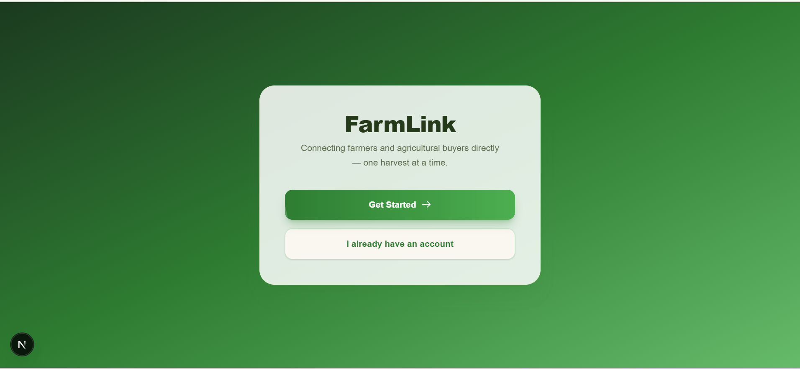
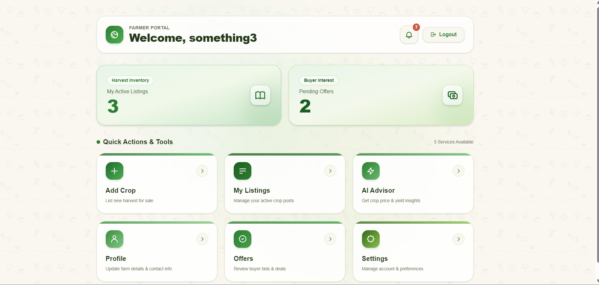
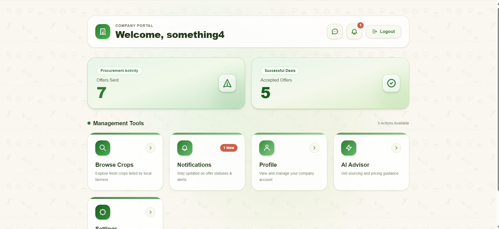
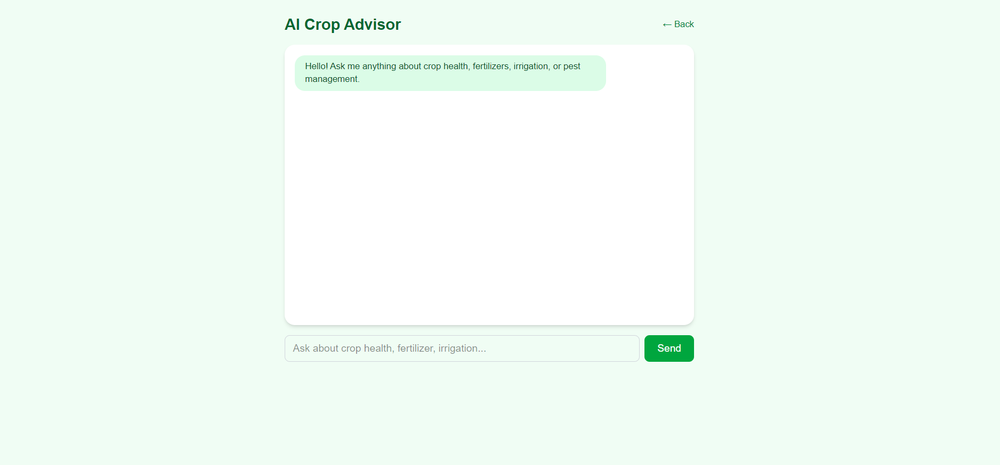
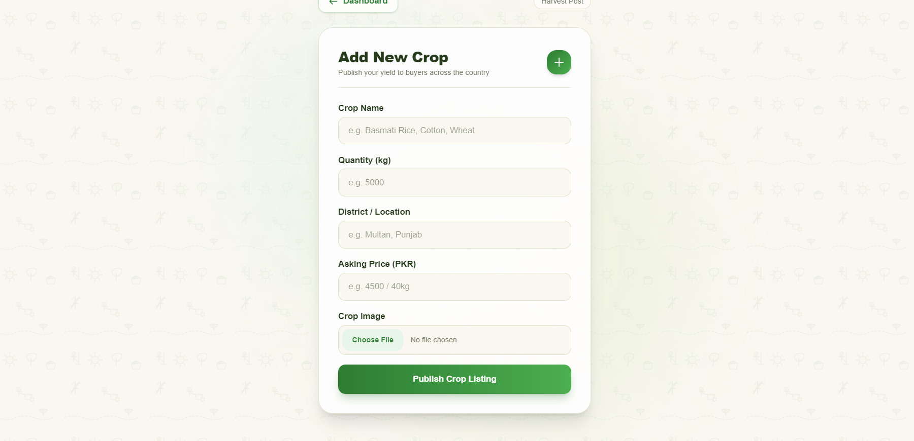
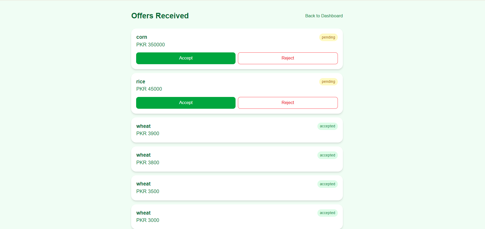
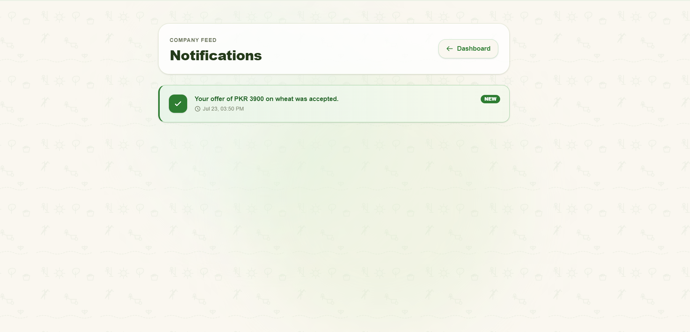

# FarmLink

**FarmLink** is a full-stack agricultural marketplace web app that connects farmers directly with verified buying companies in Pakistan — eliminating middlemen, so farmers get fairer prices and buyers get transparent access to crop listings.

### The problem it solves

In Pakistan's agricultural supply chain, farmers typically sell crops through middlemen (*arthis*), who take a significant cut of the sale price while farmers have little visibility into real market rates or buyer demand. On the other side, textile mills, food processors, and agricultural buyers often lack a direct, transparent way to discover and negotiate with individual farmers. FarmLink removes that middle layer: farmers list crops directly, companies browse and make offers directly, and both sides can track the deal from listing to acceptance — no broker required.

**Who it's for:** small and mid-sized farmers looking to sell produce at fair prices, and companies (textile mills, food processors, agricultural buyers) looking for a transparent way to source crops.

---

## Live App

**[https://farmlink-farooq-shah.vercel.app](https://farmlink-farooq-shah.vercel.app)**

Anyone can open this link, register as a Farmer or a Company, and use the full app immediately — no setup required.

---

## Features

### Shared
- Splash/landing screen with role-aware routing (already-logged-in users skip straight to their dashboard)
- Email/password registration with role selection (Farmer or Company)
- Secure login with Firebase Authentication
- Route protection — dashboard pages redirect unauthenticated users back to login

### Farmer side
- **Dashboard** — live counts of active listings and pending offers, plus an unread-notifications badge
- **Add Crop** — list a crop for sale with name, quantity, district, asking price, and a photo upload (stored in Firebase Storage)
- **My Listings** — view all crops the farmer has listed, with live status (available/sold)
- **Offers Received** — view every offer made on their crops and Accept or Reject each one; responding automatically notifies the company
- **AI Crop Advisor** — a chat interface for asking questions about crop health, fertilizers, irrigation, and pest management, and for getting help using the app itself
- **Profile** — view and edit name, phone, and district
- **Settings** — manage account preferences

### Company side
- **Dashboard** — live counts of offers sent and accepted offers, plus an unread-notifications badge
- **Browse Crops** — search and filter all available crop listings by crop name and district
- **Crop Details** — full listing view with photo, quantity, district, and asking price
- **Make Offer** — submit a price offer on any crop listing
- **AI Procurement Advisor** — a chat interface for sourcing/pricing guidance and app help
- **Notifications** — see when an offer is accepted or rejected, marked read/unread
- **Settings** — manage company name, phone, and buying-rate notes

### Data model
Six Firestore collections power the app: `Users`, `Crops`, `Offers`, `Notifications`, `AIHistory`, plus Firebase Storage for crop photos. Firestore security rules restrict reads/writes to authenticated users and enforce that a document's owner ID matches the logged-in user before allowing creation.

---

## The AI Feature

FarmLink includes two AI advisors — one for Farmers, one for Companies — each a chat interface backed by its own secure Next.js API route (so the Gemini API key never reaches the browser). Every question is sent to Google's Gemini model along with a fixed system prompt, and every exchange is logged to the `AIHistory` collection in Firestore.

**System prompt used for the Farmer AI Advisor:**
You are FarmLink's AI Crop Advisor, helping farmers in Pakistan make better decisions about their crops and use the FarmLink app effectively.
You can help with two kinds of questions:
FARMING ADVICE — crop health, fertilizers, irrigation, and pest/disease management.
Give simple, practical, actionable advice — avoid jargon; explain any technical term you must use.
Consider Pakistan's common crops (wheat, rice, cotton, sugarcane, maize) and local growing seasons (Rabi/Kharif) when relevant.
Keep answers concise: 3-5 short sentences, using bullet points for steps if there are multiple.
Never invent facts or statistics. If you're unsure, say so honestly.
For severe issues (major crop disease outbreaks, large-scale pest infestation, suspected chemical contamination), advise the farmer to consult a local agricultural extension officer or expert immediately.
APP HELP — guiding farmers who are confused about using the FarmLink app itself.
FarmLink connects farmers directly with companies buying crops.
Farmer Dashboard features: My Active Listings (view active crop listings), Pending Offers (offers awaiting response), Add Crop (list a new crop for sale), My Listings (manage existing listings), AI Advisor (this chat), Profile, and Offers.
If a farmer asks how to do something in the app (e.g. "how do I list my wheat", "where do I see offers", "how do I check my profile"), give clear, short, step-by-step guidance using the actual feature names above.
If you don't know the answer to an app question, say so honestly and suggest they check the relevant dashboard tab or contact support — don't guess at features that don't exist.
GENERAL RULES:
If a farmer's question is unrelated to farming or the app, gently redirect them back to these topics.
If the question is in Urdu or Roman Urdu, respond in the same language style the farmer used.
Keep every response friendly, respectful, and easy to understand for someone who may not be tech-savvy.

**System prompt used for the Company AI Advisor:**
You are FarmLink's AI Procurement Advisor, helping agricultural buying companies in Pakistan make smart sourcing and purchasing decisions, and use the FarmLink app effectively.
You can help with two kinds of questions:
PROCUREMENT & SOURCING ADVICE
Help companies understand fair market pricing ranges for common Pakistani crops (wheat, rice, cotton, sugarcane, maize), based on general market knowledge — always clarify that real-time prices should be verified locally.
Offer guidance on evaluating crop quality, negotiating with farmers respectfully and fairly, and building long-term supplier relationships.
Give simple, practical, actionable advice — avoid jargon; explain any technical term you must use.
Keep answers concise: 3-5 short sentences, using bullet points for steps if there are multiple.
Never invent specific prices or statistics you don't actually know. If unsure, say so honestly and suggest checking current local market rates.
Encourage fair, ethical dealing with farmers — never suggest exploiting a farmer's lack of information.
APP HELP — guiding company users who are confused about using the FarmLink app itself.
FarmLink connects companies directly with farmers selling crops.
Company Dashboard features: Offers Sent (offers made to farmers), Accepted Offers (successfully completed deals), Browse Crops (explore farmer listings), Notifications (offer status updates), Settings (manage company details and buying rates), and Profile.
If a company user asks how to do something in the app (e.g. "how do I make an offer", "where do I see my accepted deals"), give clear, short, step-by-step guidance using the actual feature names above.
If you don't know the answer to an app question, say so honestly and suggest they check the relevant dashboard tab or contact support — don't guess at features that don't exist.
GENERAL RULES:
If a question is unrelated to procurement, crops, or the app, gently redirect back to these topics.
If the question is in Urdu or Roman Urdu, respond in the same language style used.
Keep every response professional, respectful, and clear.

This keeps both advisors scoped to their actual jobs, explicitly forbids inventing facts or prices, requires severe issues to be escalated to a real expert, and matches the user's language style (English, Urdu, or Roman Urdu) automatically.

---

## Tools, Services & Models Used

| Category | Choice |
|---|---|
| Framework | Next.js (App Router) + React |
| Language | TypeScript |
| Styling | Tailwind CSS |
| Authentication | Firebase Authentication (Email/Password) |
| Database | Firebase Firestore |
| File storage | Firebase Storage (crop photos) |
| AI model | Google Gemini (via Google AI Studio API key) |
| Hosting / Deployment | Vercel |
| Version control | Git + GitHub |

---

## Screenshots

---

## How to Run the Project Locally

**Prerequisites:** Node.js (LTS) and a Firebase project with Authentication, Firestore, and Storage enabled, plus a Gemini API key.

1. **Clone the repository**

git clone https://github.com/FSMultimeter/farmlink.git
cd farmlink

2. **Install dependencies**

3. **Create a `.env.local` file** in the project root with your own keys (never commit this file):

NEXT_PUBLIC_FIREBASE_API_KEY=your_key
NEXT_PUBLIC_FIREBASE_AUTH_DOMAIN=your_project.firebaseapp.com
NEXT_PUBLIC_FIREBASE_PROJECT_ID=your_project_id
NEXT_PUBLIC_FIREBASE_STORAGE_BUCKET=your_project.firebasestorage.app
NEXT_PUBLIC_FIREBASE_MESSAGING_SENDER_ID=your_sender_id
NEXT_PUBLIC_FIREBASE_APP_ID=your_app_id
GEMINI_API_KEY=your_gemini_key

4. **Run the development server**
Open [http://localhost:3000](http://localhost:3000) in your browser.

5. **Deploying:** the project is deployed on Vercel — connect the GitHub repo to a Vercel project and add the same environment variables in the Vercel dashboard under Project Settings → Environment Variables.

---

## Project Structure
src/app/
page.tsx # Splash screen
login/, register/ # Auth screens
farmer/ # Farmer dashboard, add-crop, my-listings,
# offers, ai-advisor, profile, settings
company/ # Company dashboard, browse, crop/[id],
# make-offer/[id], notifications, settings
api/advisor/ # Secure server-side Gemini API routes
lib/firebase.ts # Firebase initialization